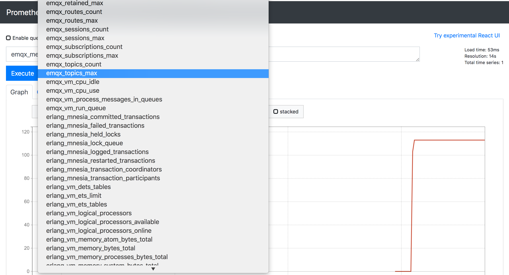
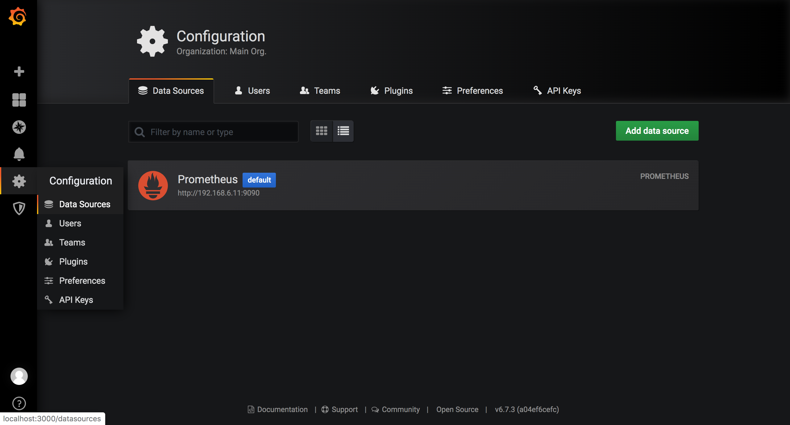
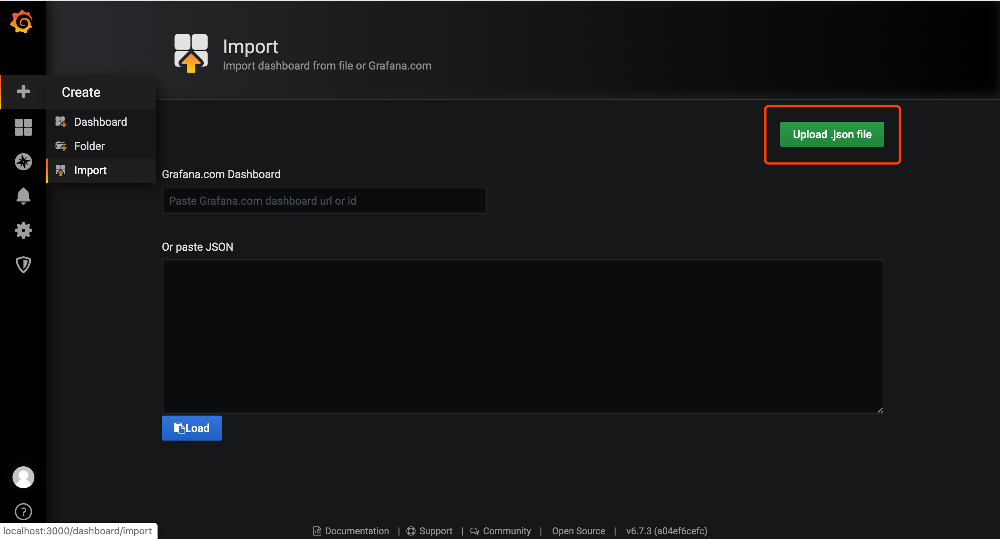
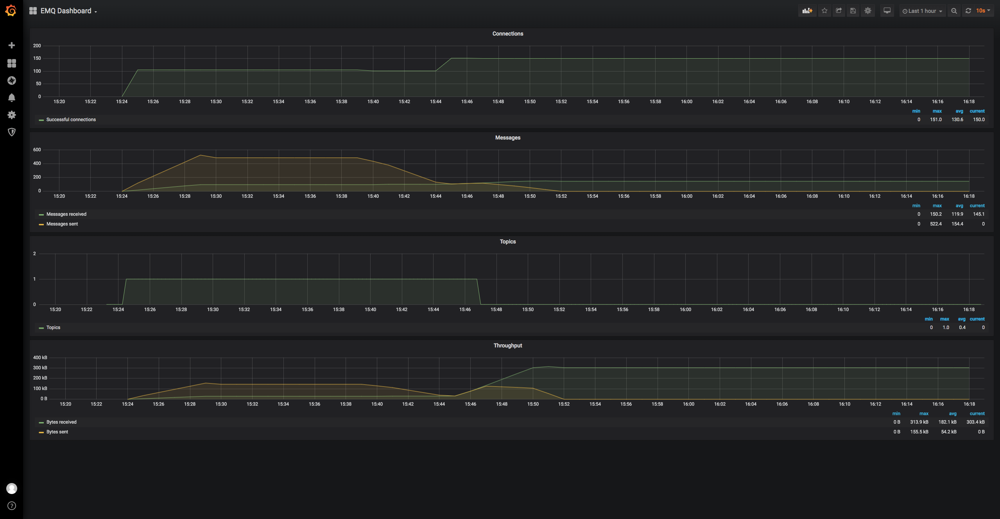
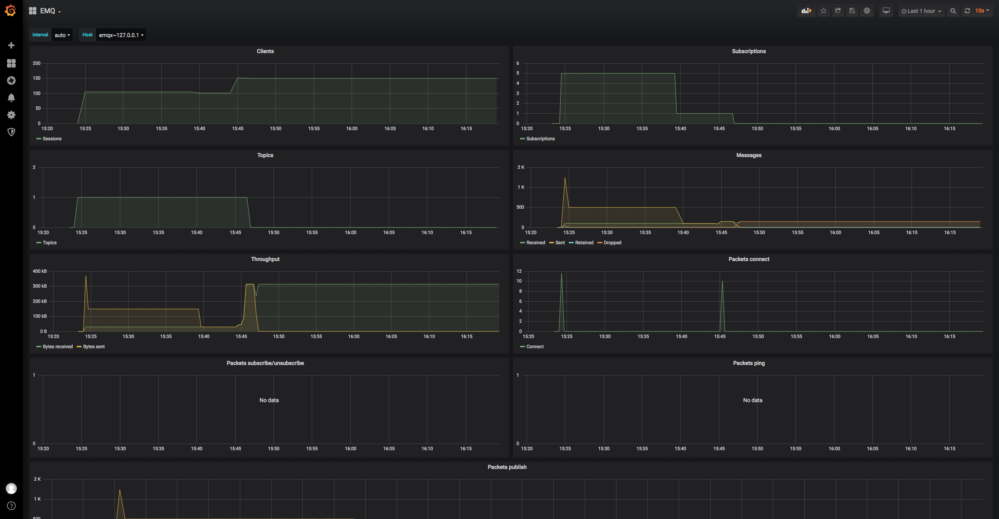

# PrometheusとGrafanaに基づくEMQX IoTMQTTサーバーの視覚的な操作と保守の監視

[toc]

> [Prometheus](https://prometheus.io/)は、SoundCloudによるオープンソースの監視およびアラームソリューションであり、多次元[データモデル](https://prometheus.io/docs/concepts/data_model/)をサポートします(時系列はメトリックによって名前が付けられます)また、k / vラベル)、柔軟なクエリステートメント([PromQL](https://prometheus.io/docs/querying/basics/))を使用し、複数のデータ収集[エクスポーター](https：//prometheus.io/docs/Instruments/exporters/);アラーム監視を実現するためのインジケーターに基づいて、アラーム管理をサポートします。組み込みのブラウザーに加えて、複数の統計データモデル、グラフィカル表示に適したグラフィカル表示をサポートし、Grafana統合もサポートします。


Internet of ThingsMQTTサーバー[EMQX](https://www.emqx.io/cn/)は、EMQ X操作インジケーターの統合に使用される[emqx_statsd](https://github.com/emqx/emqx-statsd)プラグインを提供しますまた、Erlang仮想マシンのステータスデータは、Prometheusなどのサードパーティの監視システムに出力されます。 Prometheusに付属のnode-exporterを使用して、Linuxサーバー関連のインジケーターを収集し、サーバー+ EMQXの全体的な運用および保守の監視を実現することもできます。

この記事では、Prometheus + Grafanaの完全なEMQX操作および保守監視ソリューションの構築プロセスについて説明します。


## インストールと準備

### Dockerイメージのダウンロード

```bash
# Dockerイメージパッケージのダウンロード
docker pull prom/node-exporter
docker pull prom/prometheus
docker pull prom/pushgateway
```


### node-exporterを起動します

オプション。CPU、メモリ、ネットワークなどのサーバーメトリックを収集するために使用されます。Dockerを使用してインストールする場合は、ターゲットサーバーの応答ステータスファイルをマップする必要があります。

```shell
docker run -d -p 9100:9100 \
  -v "/proc:/host/proc:ro" \
  -v "/sys:/host/sys:ro" \
  -v "/:/rootfs:ro" \
  --net="host" \
  prom/node-exporter
```


### プッシュゲートウェイを開始します

pushgatewayは、EMQ Xインジケータープッシュデータを受信するために使用されます。**EMQXがアクセスできることを確認する必要があります**：

```bash
docker run -d -p 9091:9091 prom/pushgateway
```


### Prometheusを開始します

Prometheusを起動するための構成ファイルとリスニングポートを指定します。

```bash
# 構成ファイルを指定して開始します
docker run -p 9090:9090 \
	-v $PWD/prometheus.yaml:/etc/prometheus/prometheus.yaml \
	-d prom/prometheus \
	--config.file=/etc/prometheus/prometheus.yaml
```

Prometheus構成ファイル `prometheus.yaml`の例は次のとおりです。詳細については、[Prometheusドキュメント](https://prometheus.io/docs/prometheus/latest/configuration/configuration/)を参照してください。

```yaml
# prometheus.yaml
global:
  scare_interval：10s#デフォルトのクロール時間
  Evaluation_interval：10s#10秒ごとにルールを評価する

  # これは、このマシンのすべての時系列でデフォルトで生成され、共同クエリ、リモートストレージ、およびAlertmanagerに使用できます。
  external_labels:
      monitor: 'emqx-monitor'

# ルールをロードし、evaluation_intervalに従って定期的にルールを評価します
rule_files:
  # - "first.rules"
  # - "second.rules"
  - "/etc/prometheus/rules/*.rules"

# データプル構成
scrape_configs:
  # この構成の時系列の例を表します。それぞれに{job_name： "prometheus"}のラベルが自動的に追加されます。
  - job_name: 'prometheus'
    scrape_interval: 5s
    static_configs:
      - targets: ['127.0.0.1:9090']

#サーバーの物理マシンの監視
  - job_name: 'node-exporter'
    scrape_interval: 5s
    static_configs:
      # node-exporterは実際の状況に応じて記入します
      - targets: ['192.168.6.11:9100']
        labels:
          instance: wivwiv-local


  # EMQXプッシュゲートウェイの監視
  - job_name: 'pushgateway'
    scrape_interval: 5s
    honor_labels: true
    static_configs:
      # プッシュゲートウェイは実際の状況に応じて記入します
      - targets: ['192.168.6.11:9091']
```


### EMQ Xstatsdプラグインを起動します

`etc/emqx_statsd.conf`を開き、次の設定を確認します。

```bash
## プッシュゲートウェイアドレス
statsd.push.gateway.server = http://127.0.0.1:9091
## データ収集/プッシュサイクル(ms)
statsd.interval = 15000
```

プラグインを開始します。

`./bin/emqx_ctl load plugins emqx_statsd`


## エフェクトビュー

`docker ps -a`コマンドを使用して、コンポーネントが正常に実行されているかどうかを確認します。数回のプッシュサイクルを待った後、http：// localhost：9090Prometheusコントロールパネルを開いて収集されたデータを表示します。

> Prometheusは単純なチャートデータ表示のみを提供します。より精巧な視覚的表示が必要な場合は、Grafanaと組み合わせて使用​​してください。




## グラファナを統合する

Grafanaは、オープンソースのユニバーサル測定分析および視覚化表示ツールであり、データソース(さまざまなデータベース、オープンソースコンポーネントなど)を介してカスタムレポート、表示チャートなどを表示します。


### Grafanaを開始します

Dockerを介してGrafanaイメージをプルして開始します。

```bash
docker run -d --name=grafana -p 3000:3000 grafana/grafana
```

起動が成功すると、ブラウザはhttp://127.0.0.1:3000にアクセスしてダッシュボードコンソールを開きます。


### Prometheusデータソースを構成する

Grafanaにデータソースを追加し、Prometheusを選択し、正しいアドレスを入力して、データソースの追加を完了します。




### Grafanaテンプレートデータをインポートする

`emqx_statsd`プラグインは、EMQX監視データの表示のほとんどを含むGrafanaのダッシュボードテンプレートファイルを提供します。ユーザーはそれをGrafanaに直接インポートして、EMQX監視ステータスのアイコンを表示できます。

テンプレートファイルは[emqx_statsd / grafana_template](https://github.com/emqx/emqx-statsd/tree/master/grafana_template)にあります。**EMQXのバージョンの違いにより、チャートデータの表示エラーが発生する場合があります。適応を手動で調整してください。****

**Upload.jsonファイル** ボタンをクリックし、インポート後に対応するフォルダーとデータソースを選択します。




### 結果を示す

システム全体が構築され、一定期間実行されると、Prometheusによって収集されたデータがGrafanaに表示されます。デフォルトのテンプレート表示効果は次のとおりです。

- EMQダッシュボード：接続、メッセージ、トピック、およびスループットに関する履歴統計が含まれています
- EMQ：クライアント数、サブスクリプション、トピック、メッセージ、メッセージなどのビジネス情報の履歴統計が含まれています
- ErlangVM：各EMQ XノードのErlang仮想マシンプロセス/スレッドの数、ETS / Mnesiaデータベース使用の履歴統計

**他の要件がある場合は、"添付ファイル：emqx-statsdのすべてのインジケーター"を参照し、Grafanaと組み合わせてアイコンデータを配置および表示できます。****








## アラーム管理

PrometheusとGrafanaはどちらもインジケーターアラーム機能をサポートしています。アラームルールが設定された後、サーバーは設定されたルールと現在のインジケーターデータを継続的に評価し、ルール条件が満たされたときに通知を送信します。

スペースに限りがありますので、アラーム関連の設定と練習についてはフォローアップ記事に注意してください。


## 添付ファイル：emqx-statsdのすべてのインジケーター

[EMQ X](https://www.emqx.io/cn/)MQTTサーバーはPrometheusプッシュゲートウェイを介してインジケーターデータをプッシュします。サポートされているインジケーターアイテムは次のとおりです。

```bash
# TYPE erlang_vm_ets_limit gauge
erlang_vm_ets_limit 256000
# TYPE erlang_vm_logical_processors gauge
erlang_vm_logical_processors 4
# TYPE erlang_vm_logical_processors_available gauge
erlang_vm_logical_processors_available NaN
# TYPE erlang_vm_logical_processors_online gauge
erlang_vm_logical_processors_online 4
# TYPE erlang_vm_port_count gauge
erlang_vm_port_count 16
# TYPE erlang_vm_port_limit gauge
erlang_vm_port_limit 1048576
# TYPE erlang_vm_process_count gauge
erlang_vm_process_count 320
# TYPE erlang_vm_process_limit gauge
erlang_vm_process_limit 2097152
# TYPE erlang_vm_schedulers gauge
erlang_vm_schedulers 4
# TYPE erlang_vm_schedulers_online gauge
erlang_vm_schedulers_online 4
# TYPE erlang_vm_smp_support untyped
erlang_vm_smp_support 1
# TYPE erlang_vm_threads untyped
erlang_vm_threads 1
# TYPE erlang_vm_thread_pool_size gauge
erlang_vm_thread_pool_size 4
# TYPE erlang_vm_time_correction untyped
erlang_vm_time_correction 1
# TYPE erlang_vm_statistics_context_switches counter
erlang_vm_statistics_context_switches 20767
# TYPE erlang_vm_statistics_garbage_collection_number_of_gcs counter
erlang_vm_statistics_garbage_collection_number_of_gcs 3924
# TYPE erlang_vm_statistics_garbage_collection_words_reclaimed counter
erlang_vm_statistics_garbage_collection_words_reclaimed 6751048
# TYPE erlang_vm_statistics_garbage_collection_bytes_reclaimed counter
erlang_vm_statistics_garbage_collection_bytes_reclaimed 54008384
# TYPE erlang_vm_statistics_bytes_received_total counter
erlang_vm_statistics_bytes_received_total 23332
# TYPE erlang_vm_statistics_bytes_output_total counter
erlang_vm_statistics_bytes_output_total 21266
# TYPE erlang_vm_statistics_reductions_total counter
erlang_vm_statistics_reductions_total 18413181
# TYPE erlang_vm_statistics_run_queues_length_total gauge
erlang_vm_statistics_run_queues_length_total 0
# TYPE erlang_vm_statistics_runtime_milliseconds counter
erlang_vm_statistics_runtime_milliseconds 1782
# TYPE erlang_vm_statistics_wallclock_time_milliseconds counter
erlang_vm_statistics_wallclock_time_milliseconds 68277
# TYPE erlang_vm_memory_atom_bytes_total gauge
erlang_vm_memory_atom_bytes_total{usage="used"} 1507142
erlang_vm_memory_atom_bytes_total{usage="free"} 18787
# TYPE erlang_vm_memory_bytes_total gauge
erlang_vm_memory_bytes_total{kind="system"} 63949544
erlang_vm_memory_bytes_total{kind="processes"} 45457848
# TYPE erlang_vm_dets_tables gauge
erlang_vm_dets_tables 0
# TYPE erlang_vm_ets_tables gauge
erlang_vm_ets_tables 115
# TYPE erlang_vm_memory_processes_bytes_total gauge
erlang_vm_memory_processes_bytes_total{usage="used"} 45457696
erlang_vm_memory_processes_bytes_total{usage="free"} 152
# TYPE erlang_vm_memory_system_bytes_total gauge
erlang_vm_memory_system_bytes_total{usage="atom"} 1525929
erlang_vm_memory_system_bytes_total{usage="binary"} 104504
erlang_vm_memory_system_bytes_total{usage="code"} 26779999
erlang_vm_memory_system_bytes_total{usage="ets"} 7685312
erlang_vm_memory_system_bytes_total{usage="other"} 27853800
# TYPE erlang_mnesia_held_locks gauge
erlang_mnesia_held_locks 0
# TYPE erlang_mnesia_lock_queue gauge
erlang_mnesia_lock_queue 0
# TYPE erlang_mnesia_transaction_participants gauge
erlang_mnesia_transaction_participants 0
# TYPE erlang_mnesia_transaction_coordinators gauge
erlang_mnesia_transaction_coordinators 0
# TYPE erlang_mnesia_failed_transactions counter
erlang_mnesia_failed_transactions 21
# TYPE erlang_mnesia_committed_transactions counter
erlang_mnesia_committed_transactions 128
# TYPE erlang_mnesia_logged_transactions counter
erlang_mnesia_logged_transactions 3
# TYPE erlang_mnesia_restarted_transactions counter
erlang_mnesia_restarted_transactions 0
# TYPE emqx_connections_count gauge
emqx_connections_count 0
# TYPE emqx_connections_max gauge
emqx_connections_max 0
# TYPE emqx_sessions_count gauge
emqx_sessions_count 0
# TYPE emqx_sessions_max gauge
emqx_sessions_max 0
# TYPE emqx_topics_count gauge
emqx_topics_count 0
# TYPE emqx_topics_max gauge
emqx_topics_max 0
# TYPE emqx_suboptions_count gauge
emqx_suboptions_count 0
# TYPE emqx_suboptions_max gauge
emqx_suboptions_max 0
# TYPE emqx_subscribers_count gauge
emqx_subscribers_count 0
# TYPE emqx_subscribers_max gauge
emqx_subscribers_max 0
# TYPE emqx_subscriptions_count gauge
emqx_subscriptions_count 0
# TYPE emqx_subscriptions_max gauge
emqx_subscriptions_max 0
# TYPE emqx_subscriptions_shared_count gauge
emqx_subscriptions_shared_count 0
# TYPE emqx_subscriptions_shared_max gauge
emqx_subscriptions_shared_max 0
# TYPE emqx_routes_count gauge
emqx_routes_count 0
# TYPE emqx_routes_max gauge
emqx_routes_max 0
# TYPE emqx_retained_count gauge
emqx_retained_count 3
# TYPE emqx_retained_max gauge
emqx_retained_max 3
# TYPE emqx_vm_cpu_use gauge
emqx_vm_cpu_use 12.029950083194677
# TYPE emqx_vm_cpu_idle gauge
emqx_vm_cpu_idle 87.97004991680532
# TYPE emqx_vm_run_queue gauge
emqx_vm_run_queue 1
# TYPE emqx_vm_process_messages_in_queues gauge
emqx_vm_process_messages_in_queues 0
# TYPE emqx_bytes_received counter
emqx_bytes_received 0
# TYPE emqx_bytes_sent counter
emqx_bytes_sent 0
# TYPE emqx_packets_received counter
emqx_packets_received 0
# TYPE emqx_packets_sent counter
emqx_packets_sent 0
# TYPE emqx_packets_connect counter
emqx_packets_connect 0
# TYPE emqx_packets_connack_sent counter
emqx_packets_connack_sent 0
# TYPE emqx_packets_connack_error counter
emqx_packets_connack_error 0
# TYPE emqx_packets_connack_auth_error counter
emqx_packets_connack_auth_error 0
# TYPE emqx_packets_publish_received counter
emqx_packets_publish_received 0
# TYPE emqx_packets_publish_sent counter
emqx_packets_publish_sent 0
# TYPE emqx_packets_publish_inuse counter
emqx_packets_publish_inuse 0
# TYPE emqx_packets_publish_error counter
emqx_packets_publish_error 0
# TYPE emqx_packets_publish_auth_error counter
emqx_packets_publish_auth_error 0
# TYPE emqx_packets_publish_dropped counter
emqx_packets_publish_dropped 0
# TYPE emqx_packets_puback_received counter
emqx_packets_puback_received 0
# TYPE emqx_packets_puback_sent counter
emqx_packets_puback_sent 0
# TYPE emqx_packets_puback_inuse counter
emqx_packets_puback_inuse 0
# TYPE emqx_packets_puback_missed counter
emqx_packets_puback_missed 0
# TYPE emqx_packets_pubrec_received counter
emqx_packets_pubrec_received 0
# TYPE emqx_packets_pubrec_sent counter
emqx_packets_pubrec_sent 0
# TYPE emqx_packets_pubrec_inuse counter
emqx_packets_pubrec_inuse 0
# TYPE emqx_packets_pubrec_missed counter
emqx_packets_pubrec_missed 0
# TYPE emqx_packets_pubrel_received counter
emqx_packets_pubrel_received 0
# TYPE emqx_packets_pubrel_sent counter
emqx_packets_pubrel_sent 0
# TYPE emqx_packets_pubrel_missed counter
emqx_packets_pubrel_missed 0
# TYPE emqx_packets_pubcomp_received counter
emqx_packets_pubcomp_received 0
# TYPE emqx_packets_pubcomp_sent counter
emqx_packets_pubcomp_sent 0
# TYPE emqx_packets_pubcomp_inuse counter
emqx_packets_pubcomp_inuse 0
# TYPE emqx_packets_pubcomp_missed counter
emqx_packets_pubcomp_missed 0
# TYPE emqx_packets_subscribe_received counter
emqx_packets_subscribe_received 0
# TYPE emqx_packets_subscribe_error counter
emqx_packets_subscribe_error 0
# TYPE emqx_packets_subscribe_auth_error counter
emqx_packets_subscribe_auth_error 0
# TYPE emqx_packets_suback_sent counter
emqx_packets_suback_sent 0
# TYPE emqx_packets_unsubscribe_received counter
emqx_packets_unsubscribe_received 0
# TYPE emqx_packets_unsubscribe_error counter
emqx_packets_unsubscribe_error 0
# TYPE emqx_packets_unsuback_sent counter
emqx_packets_unsuback_sent 0
# TYPE emqx_packets_pingreq_received counter
emqx_packets_pingreq_received 0
# TYPE emqx_packets_pingresp_sent counter
emqx_packets_pingresp_sent 0
# TYPE emqx_packets_disconnect_received counter
emqx_packets_disconnect_received 0
# TYPE emqx_packets_disconnect_sent counter
emqx_packets_disconnect_sent 0
# TYPE emqx_packets_auth_received counter
emqx_packets_auth_received 0
# TYPE emqx_packets_auth_sent counter
emqx_packets_auth_sent 0
# TYPE emqx_messages_received counter
emqx_messages_received 0
# TYPE emqx_messages_sent counter
emqx_messages_sent 0
# TYPE emqx_messages_qos0_received counter
emqx_messages_qos0_received 0
# TYPE emqx_messages_qos0_sent counter
emqx_messages_qos0_sent 0
# TYPE emqx_messages_qos1_received counter
emqx_messages_qos1_received 0
# TYPE emqx_messages_qos1_sent counter
emqx_messages_qos1_sent 0
# TYPE emqx_messages_qos2_received counter
emqx_messages_qos2_received 0
# TYPE emqx_messages_qos2_sent counter
emqx_messages_qos2_sent 0
# TYPE emqx_messages_publish counter
emqx_messages_publish 0
# TYPE emqx_messages_dropped counter
emqx_messages_dropped 0
# TYPE emqx_messages_dropped_expired counter
emqx_messages_dropped_expired 0
# TYPE emqx_messages_dropped_no_subscribers counter
emqx_messages_dropped_no_subscribers 0
# TYPE emqx_messages_forward counter
emqx_messages_forward 0
# TYPE emqx_messages_retained counter
emqx_messages_retained 2
# TYPE emqx_messages_delayed counter
emqx_messages_delayed 0
# TYPE emqx_messages_delivered counter
emqx_messages_delivered 0
# TYPE emqx_messages_acked counter
emqx_messages_acked 0
# TYPE emqx_delivery_dropped counter
emqx_delivery_dropped 0
# TYPE emqx_delivery_dropped_no_local counter
emqx_delivery_dropped_no_local 0
# TYPE emqx_delivery_dropped_too_large counter
emqx_delivery_dropped_too_large 0
# TYPE emqx_delivery_dropped_qos0_msg counter
emqx_delivery_dropped_qos0_msg 0
# TYPE emqx_delivery_dropped_queue_full counter
emqx_delivery_dropped_queue_full 0
# TYPE emqx_delivery_dropped_expired counter
emqx_delivery_dropped_expired 0
# TYPE emqx_client_connected counter
emqx_client_connected 0
# TYPE emqx_client_authenticate counter
emqx_client_authenticate 0
# TYPE emqx_client_auth_anonymous counter
emqx_client_auth_anonymous 0
# TYPE emqx_client_check_acl counter
emqx_client_check_acl 0
# TYPE emqx_client_subscribe counter
emqx_client_subscribe 0
# TYPE emqx_client_unsubscribe counter
emqx_client_unsubscribe 0
# TYPE emqx_client_disconnected counter
emqx_client_disconnected 0
# TYPE emqx_session_created counter
emqx_session_created 0
# TYPE emqx_session_resumed counter
emqx_session_resumed 0
# TYPE emqx_session_takeovered counter
emqx_session_takeovered 0
# TYPE emqx_session_discarded counter
emqx_session_discarded 0
# TYPE emqx_session_terminated counter
emqx_session_terminated 0
```
